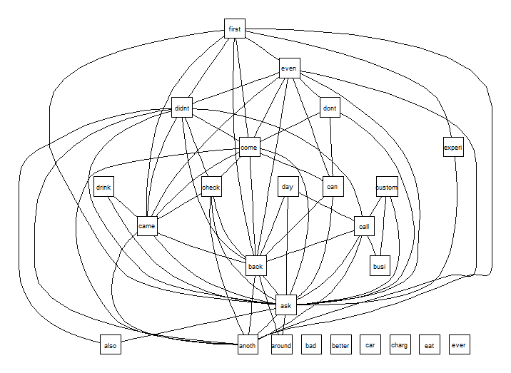
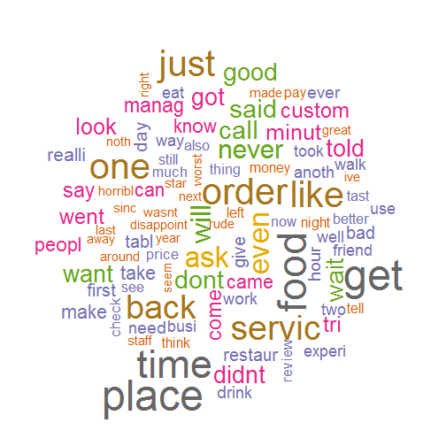

Yelp Capstone Project
========================================================
author: Calefi, AS
date: November 15, 2015
transition: rotate

Introduction
========================================================

This work is part of the capstone project from the Data Science Specialization by Coursera. This project aims to analyse the Yelp Dataset Challenge to find the words related to worst comments, identify them and find associations between words. Yelp is a website founded in 2004 to help people to find local business. People can create a free account and rate the visited business by one to five stars and make a review of each establishment.

Materials and Methods
========================================================

* Data were cleaned and processed with **Text Mining** packages. 
* The first step were load `.JSON` files into R. 
* After it, reviews by star rating were extracted and cleaned to remove numbers, whitespaces, punctuations and lowercase transformations.
* Correlation plots were defined using a correlation threshold using the `tm` package. 
* A term frequency were constructed and presented by wordclouds after a Term Document Matrix Transformation.

Packages used: `tm`, `wordcloud`, `rjoson` and associated 

Results
========================================================

* One word correlation plots shows correlations needs to be above 0.15.

* Word frequency analysis shows that the word **"bad"** is a keyword to reviews related to one, two and three star.

* When we saw sparse terms we can find another words like "horrible" that has high frequency into the dataset and can be used as predictors for bad evaluations.

* This pre-processing proved to be necessary to proceed with machine learning aplications and other analysis such as tokenization (**Weka**, **OpenNLP**)

Results
=======================================================
Figure 1: Correlation plot for words of one star reviews of Yelp dataset.

***
Figure 2: Word cloud with frequencies of one star reviews of Yelp dataset.
 

Conclusions
======================================================

* A single word analysis prove to be a week method to find keywords, although we find that the word "bad" is a keyword between low stars and have a high frequency with low correlations between other words.

* The data cleaning and manipulation to construct a Document Term Matrix prove to be an efficient method to data processing by tokenization (by Weka) and machine learning. However this data procedure can not be performed due to computer memory limitations.
